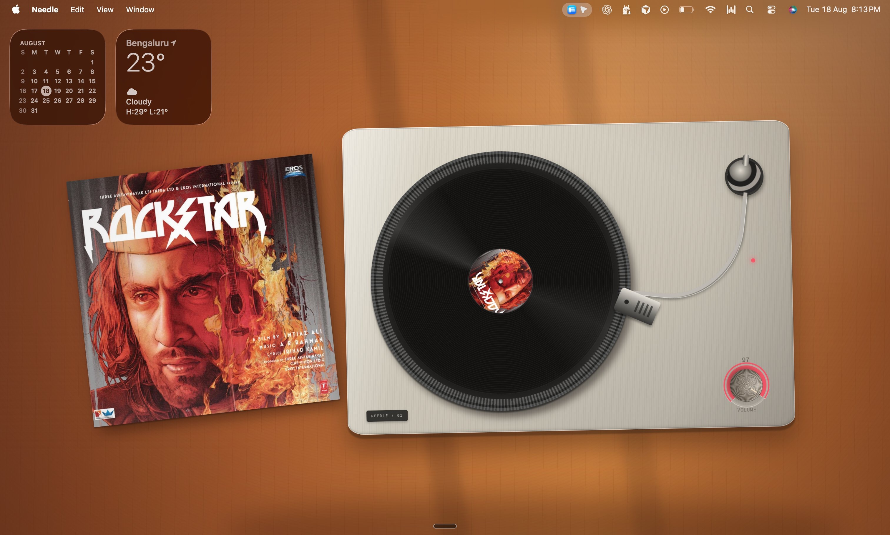

# Needle

A turntable that lives on your Mac desktop and plays whatever you're already playing.



[Download for Mac](https://vinyl-mac.vercel.app/download/) ·
[Try it in the browser](https://vinyl-mac.vercel.app/player/) ·
[Website](https://vinyl-mac.vercel.app/)

[](LICENSE)
[](https://vinyl-mac.vercel.app/download/)

Needle sits behind your icons as a live wallpaper. Start a song in Apple Music, Spotify, or a
browser tab, and the record drops, the tonearm swings in, and the label shows the real cover art.
No account, no API key, no companion app to babysit.

<!--
More screenshots to add - drop the files in docs/screenshots/ and uncomment:

| Playback controls | Multi-display |
| --- | --- |
|  |  |


-->

## Features

- **Follows what's already playing** - Apple Music, Spotify, YouTube Music, and any site that
  publishes a macOS Now Playing session (SoundCloud, Bandcamp, podcast players, video sites).
- **Real cover art** - starts from the artwork macOS gives it, then finds a sharper version and
  checks it against the original before swapping.
- **Tactile controls** - drag the tonearm off the record to pause, put it back to resume. The volume
  knob drags, scrolls, and takes arrow keys, with quiet mechanical ticks you can turn off.
- **True desktop wallpaper** - a click-through window behind Finder's icons, with its own wallpaper
  window on every connected display.
- **Scene lighting** - the room warms and cools with the time of day.
- **Set and forget** - *Needle → Set as Default Wallpaper* keeps the wallpaper running after you
  close the controls. Click the Dock icon to bring them back.
- **Quiet by default** - no account, no analytics, no music-service login. Playback detection and
  control stay on your Mac. See the [privacy policy](https://vinyl-mac.vercel.app/privacy/).
- **Free and MIT-licensed**, with a web player you can try before downloading anything.

## Install

**Requirements:** Apple silicon Mac, macOS 13 Ventura or later.

1. [Download Needle.dmg](https://vinyl-mac.vercel.app/download/).
2. Open the DMG and drag **Needle** into Applications.
3. Launch it. The wallpaper starts right away.
4. The first time it reads a native music app, macOS asks for Automation permission - approve it.
   You can change it later under *System Settings → Privacy & Security → Automation*.

To stop the wallpaper completely, choose **Quit Needle**.

Needle checks for updates shortly after launch and every six hours, and asks before downloading and
again before installing. If you're on a build from before the updater shipped, install the latest DMG
once by hand and updates take over from there.

### Signing and notarization

Every public release is built in CI, signed with an Apple Developer ID certificate, and **notarized
by Apple**, so it opens without a Gatekeeper warning and without right-click → Open. If macOS ever
warns you about a Needle build, you didn't get it from
[vinyl-mac.vercel.app](https://vinyl-mac.vercel.app/) or the GitHub releases page - delete it.

The app requests Automation access only, to control Apple Music or Spotify. It requests no camera,
microphone, Bluetooth, or audio-capture access.

## Privacy in one paragraph

Needle has no server, no account, and no telemetry. Track title, artist, artwork, and playback state
are read on your Mac and stay there. The only outbound requests are artwork lookups - title and
artist sent to the public iTunes Search API, YouTube Music, and Spotify's oEmbed endpoint - and the
update check. Audio and credentials are never sent anywhere. Full detail:
[privacy policy](https://vinyl-mac.vercel.app/privacy/) · [terms](https://vinyl-mac.vercel.app/terms/).

## Build from source

```bash
npm install
npm run dev        # web renderer at http://localhost:3000
npm run desktop:dev  # web renderer + native window together
```

The desktop build embeds the music bridge, so there is no companion process to start.

```bash
npm run desktop:pack   # unpacked app at release/mac-arm64/Needle.app
npm run desktop:dmg    # distributable DMG
npm run build          # web build
```

The first native build downloads and checksum-verifies the pinned
[`mediaremote-adapter`](https://github.com/ungive/mediaremote-adapter) source and compiles it in.
Needle bundles the adapter and its BSD 3-Clause license.

### Live music during web development

```bash
npm run companion   # localhost-only now-playing bridge
```

Then play something in Apple Music, Spotify, or a browser tab and the demo records are replaced by
the real title, artist, playback state, progress, and cover art. The companion listens only on
`127.0.0.1:43117` and accepts requests only from localhost origins; the packaged macOS app calls the
bridge directly through isolated Electron IPC and never opens that port.

## Releasing

Bump the stable semantic version in `package.json` and `package-lock.json` and push to `main`. The
`release-macos.yml` workflow tests, signs, and notarizes the DMG and ZIP, uploads the versioned
artifacts to Vercel Blob, and publishes `latest-mac.yml` last so clients never see a half-uploaded
release.

Required Actions secrets: `MAC_CSC_LINK`, `MAC_CSC_KEY_PASSWORD`, `APPLE_ID`,
`APPLE_APP_SPECIFIC_PASSWORD`, `APPLE_TEAM_ID`, `BLOB_READ_WRITE_TOKEN`.

## Contributing

Issues and pull requests are welcome - see [CONTRIBUTING.md](CONTRIBUTING.md).

## Credits and license

Needle is MIT-licensed; see [LICENSE](LICENSE). The artwork in `public/artwork` was made for Needle.
System-wide browser metadata on macOS 15.4 and later is read through
[`mediaremote-adapter`](https://github.com/ungive/mediaremote-adapter), copyright Jonas van den Berg
and contributors, BSD 3-Clause. Third-party and trademark notices are in [NOTICE.md](NOTICE.md).
Not affiliated with Apple, Spotify, or Google.
